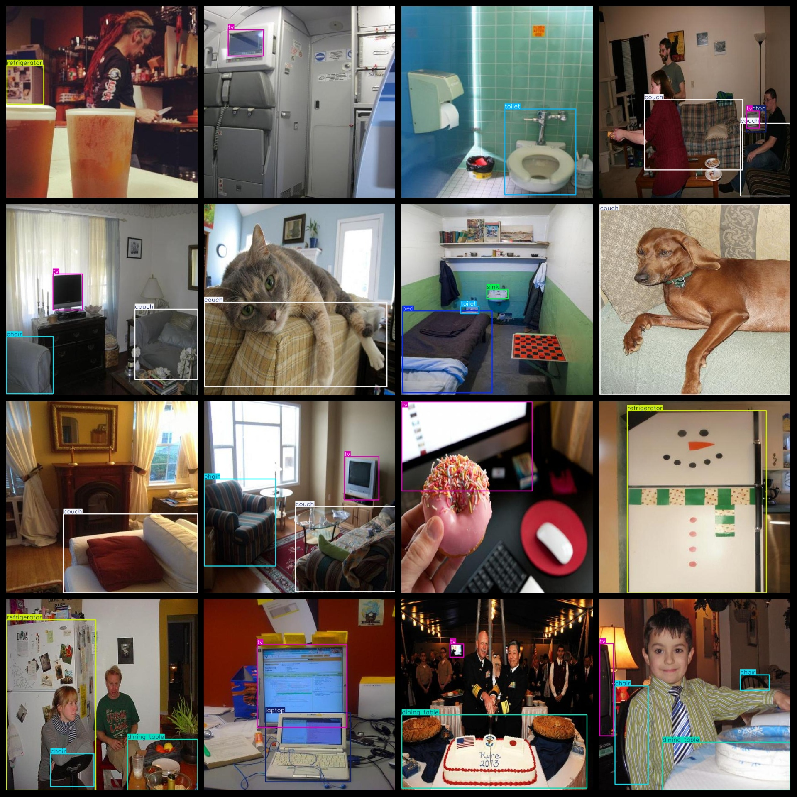
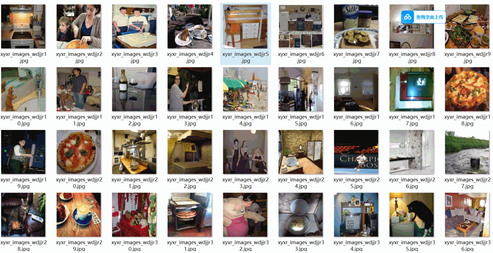

# [Object Detection] 12 types Furniture Appliance Detection Dataset 7656 images YOLO+VOC format

Dataset Format: Pascal VOC + YOLO (excluding the split-path txt file; only jpg images with corresponding VOC-format xml files and YOLO-format txt files)

The compressed file contains: three folders, each storing images, xml files, and text files.

The total number of jpg files in the JPEGImages folder is 7656.

The total number of XML files in the Annotations folder: 7656

The total number of txt files in the labels folder: 7656

Number of tag types: 12

Tags: ["bed", "chair", "couch", "dining table", "laptop", "microwave", "oven", "refrigerator", "sink", "toaster", "toilet", "tv"]

The number of boxes for each label (Note that the order of labels in the Yolo format does not correspond to this, but is based on the classes.txt file in the labels folder):

Bed frames = 1114 (beds)

Chair frame count = 6163 (chair)

Couch frame count = 1499 (seats)

Dining table frame count = 2139 (dining table)

Laptop Frame Count = 1468 (Computer)

Microwave frame number = 1109 (microwave oven)

Oven Frame Count = 1542 (Oven)

Refrigerator frame count = 1290 (refrigerator)

The number of sinks = 1935 (tank)

Toaster Frame Count = 223 (Toaster)

Toilet frame count = 1251 (toilet/commode)

The number of tv frames is 1528.

Total frame count: 21261

Picture clarity (Resolution: Pixels): Clear

Is the image enhanced: No

Shape of the label: Rectangular box, used for object detection and recognition.

Important Note: None

Special Notice: This dataset does not guarantee the accuracy or precision of the trained models or weight files. The dataset only provides accurate and reasonable annotations.

Preserve the original meaning, format markers (【】『』「」<>[]), numbers, English words, and special characters as-is. Output ONLY the English translation, no explanations, no quotes.
## Images

---

Here is a pay link on Stripe (https://buy.stripe.com/3cs8yP7sY87d0vu9AB). Please contact me lonlonago@foxmail.com after funding $89, and I will send you a complete data files, thank you!

